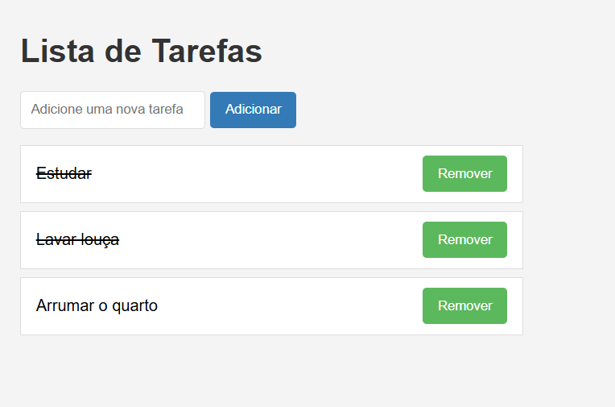

# To Do List



Um projeto simples de lista de tarefas onde você pode adicionar novas tarefas, marcar como feitas e remover tarefas. A aplicação foi desenvolvida utilizando React e JavaScript.

## 💻 Pré-requisitos

Antes de começar, verifique se você atendeu aos seguintes requisitos:

- Você instalou a versão mais recente de `Node.js` e `npm`.

## ⚙️ Funcionalidades
1. **Adicionar Tarefas**: 
* Insira uma tarefa na caixa de texto e clique no botão "Adicionar" para adicionar uma nova tarefa à lista.

2. **Marcar como Feita**: 
* Clique em cima da tarefa para marcá-la como concluída.

3. **Remover Tarefas**: 
* Clique no botão "Remover" para deletar a tarefa da lista.

## 🚀 Instalando To Do List

Para instalar o To Do List, siga estas etapas:

1. Clone o repositório:
```
git clone https://github.com/evelyn-martins/To-Do-List.git
```

2. Navegue até a pasta do projeto:
```
cd To-Do-List
```

3. Instale as dependências:
```
npm install
```

## ☕ Usando To Do List

Para usar To Do List, siga estas etapas:

1. Após instalar as dependências, você pode iniciar a aplicação com o seguinte comando:

```
npm run dev
```

2. Acesse a aplicação em seu navegador padrão, normalmente em http://localhost:5175/.


## 🤝 Colaboradores

* Evelyn Martins
